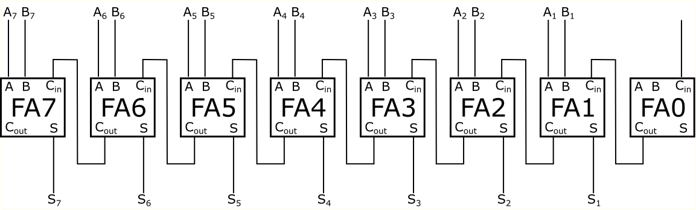
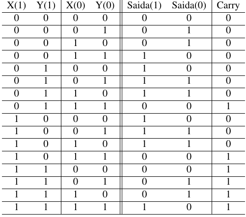
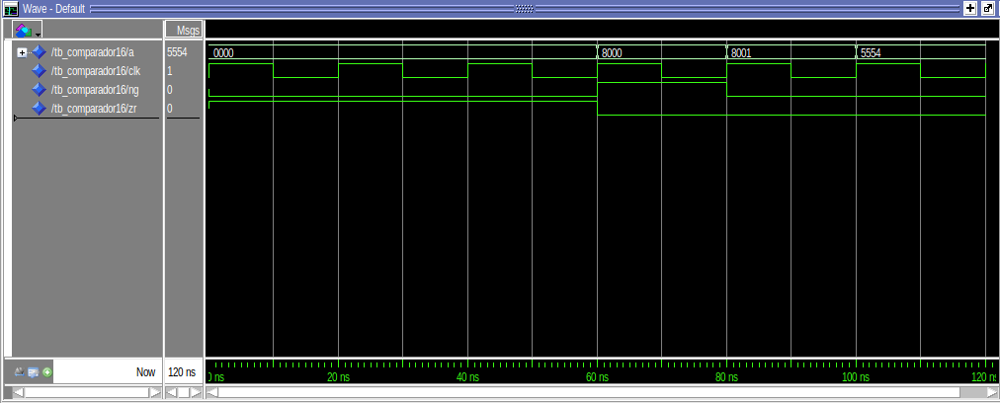
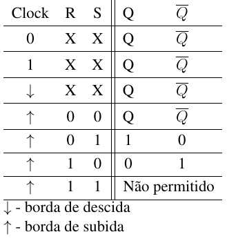

# Av2 - 1° Semestre de 2022

Avaliação 2 - Elementos de Sistemas

| Pontos HW | Pontos SW |
|:---------:|:---------:|
| 40        | 10        |

- Avaliação individual.
- 100 min total.
- Ficar conectado no canal geral no Teams (para ouvir instruções).
- Ficar no blackboard durante a prova.
- Fazer commit ao final de cada questão.
- Lembre de dar **push** ao final.

Para testar basta descomentar o módulo que deseja validar no arquivo `config_testes.txt` e executar o comando `python3 ./testeHW.py` .

## 1. Lógica combinacional - ULA

| Pontos HW | Pontos SW |
|:---------:|:---------:|
| 20        | 0         |

A figura abaixo mostra os 8 bits menos significativos da implementação do Add16 feita em aula.

{width=300}

Esse circuito tem um atraso de propagação significativo, visto que o carry out do FA0 é uma das entradas do FA1, ou seja, é necessário que o FA0 execute sua operação antes do FA1. Da mesma forma, o carry out do FA1 é uma das entradas do FA2 e assim suscessivamente. Então, para que a soma seja realizada, o carry tem que se propagar do primeiro ao último bloco FA.

Como forma de reduzir o tempo de atraso, pode-se realizar o Full Adder de outras formas. Assim, pede-se que seja montado um Full Adder de 2 bits, sem a utilização de um carry intermediário entre as somas do primeiro e do segundo bit.

### Descrição

A Tabela Verdade a seguir apresenta as saídas esperadas do Full Adder de 2 bits:

{width=300}

X, Y e Saida são do tipo STD_LOGIC_VECTOR(1 DOWNTO 0). Carry é do tipo STD_LOGIC.

### Implementação

Implemente a Saida e o Carry no arquivo `src/FullAdder2.vhd` SEM importar o módulo FullAdder ou o HalfAdder feito em aula.

-> Dica: O bit Saida(0) depende apenas de X(0) e Y(0).

**Lembre de descomentar o módulo no arquivo config_testes.txt e testar com `./testeHW.py`**

#### Rubrica para avaliação:

| Pontos HW | Descritivo                                                       |
|-----------|------------------------------------------------------------------|
| 20        | As três saídas implementadas de forma simplificada e funcionando |
| 15        | As três saídas implementadas e funcionando                       |
| 10        | Saida(0) e (Saida(1) ou Carry) implementados e funcionando       |
| 5         | Saida(0) implementada e funcionando                              |

## 1. Mux 8 Way

| Pontos HW | Pontos SW |
|:---------:|:---------:|
| 10        | 0         |

Implemente um Mux de 8 entradas utilizando necessariamente os módulos Mux2 e/ou Mux4 que estão no repositório da avaliação. Não deve ser usada nenhuma construção vhdl como with … select, when ...else, ou process. Deve-se apenas usar os módulos fornecidos.

### Implementação

Implemente o Mux no arquivo `src/Mux8.vhd` apenas usando os módulos fornecidos.

**Lembre de descomentar o módulo no arquivo config_testes.txt e testar com `./testeHW.py`**

#### Rubrica para avaliação:

| Pontos HW | Descritivo                                                          |
|-----------|---------------------------------------------------------------------|
| 10        | Implementação correta do Mux usando apenas os módulos Mux2 e/ou Mux4 fornecidos |
|           | Implementações incorretas serão analisadas caso a caso              |

## 1. Identificação de erro

| Pontos HW    | Pontos SW      |
| :--------:   | :--:           |
|    0         |  10            |

A figura a seguir apresenta as curvas obtidas no Modelsim como resultado da simulação do módulo Comparador16.
Entretanto, esse módulo não passou nos testes. Identifique, a partir das curvas fornecidas, onde a entrada 'a' é apresentada em hexadecimal, a condição em que está ocorrendo o erro.

{width=300}

### Implementação

Identifique o intervalo em que o erro ocorre e descreva qual seria o resultado esperado no arquivo `src/erro_Comparador16.txt`.

#### Rubrica para avaliação:

| Pontos SW | Descritivo                                           |
|-----------|------------------------------------------------------|
| 10        | Intervalo identificado e erro descrito corretamente. |
| 5         | Apenas o intervalo foi identificado corretamente.    |

## 1. Flip-Flop RS síncrono

| Pontos HW | Pontos SW |
|:---------:|:---------:|
| 10        | 0         |

Implemente  o Flip-Flop RS síncrono cuja tabela verdade é apresentada a seguir:

{width=300}

X, Y e Saida são do tipo STD_LOGIC_VECTOR(1 DOWNTO 0). Carry é do tipo STD_LOGIC.

### Implementação

Implemente o Flip-Flop no arquivo `src/FlipFlopRS.vhd`. 

**Lembre de descomentar o módulo no arquivo config_testes.txt e testar com `./testeHW.py`**

-> Dica: A saída para R = S = '1' não precisa ser implementada, visto que esta condição não deve ocorrer.
    
#### Rúbrica para avaliação:

| Pontos HW | Descritivo                                             |
|-----------|--------------------------------------------------------|
| 10        | Circuito implementado e funcionando.                   |
|           | Implementações incorretas serão analisadas caso a caso |
